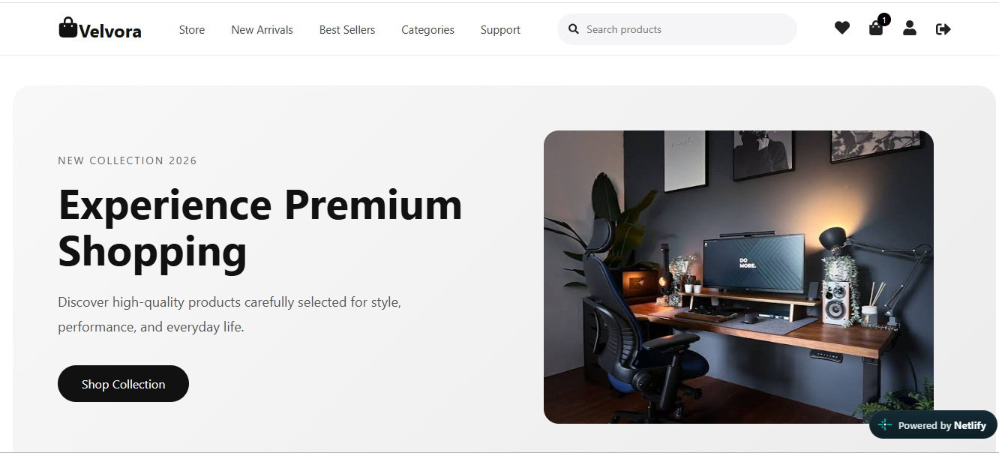
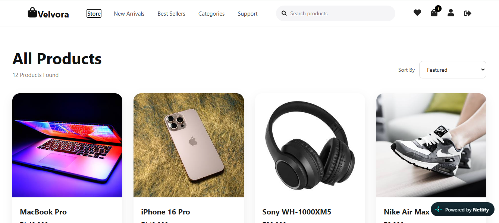
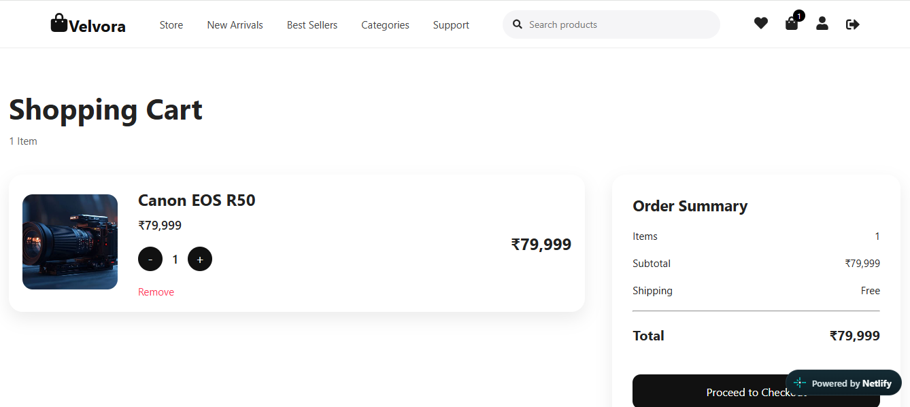
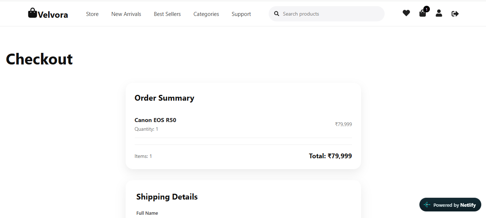

# Velvora - Full-Stack Ecommerce App

A full-stack ecommerce application built with **React, Node.js, Express, MongoDB and Razorpay**.

🌐 **Live Demo:** https://velvoraecommerce.netlify.app  
⚙️ **Backend API:** https://velvora-ecommerce-1.onrender.com  
💻 **GitHub:** https://github.com/yogendr2005/velvora-ecommerce

> The backend is deployed on Render's free tier and may take a few seconds to wake up when it receives its first request.

---

## 📸 Screenshots

### Home



### Product Details



### Shopping Cart



### Checkout



---

## 🔑 Demo Credentials

Use this account to explore the app without signing up:

| Field | Value |
|---|---|
| Email | `Yogesh@gmail.com` |
| Password | `Admin@123` |

**Razorpay test mode (no real money is charged):**

| Method | Details |
|---|---|
| Card | `4111 1111 1111 1111`, any future expiry, any CVV |
| UPI | `success@razorpay` |

---

## ✨ Features

### Frontend

- User registration and login
- JWT-based authentication
- Current user authentication
- Product listing
- Product search
- Category filtering
- Product details
- Shopping cart
- Product quantity management
- Wishlist
- Checkout
- Cash on Delivery
- Razorpay Card and UPI payments
- Order history
- User profile
- Responsive ecommerce UI
- Toast notifications
- Loading states

### Backend

- RESTful APIs with Express.js
- MongoDB with Mongoose
- JWT authentication
- Password hashing with bcrypt
- Product CRUD operations
- Category management
- Cart management
- Wishlist management
- Order management
- User profile management
- Razorpay payment integration
- Razorpay payment signature verification
- Product stock management
- Centralized error handling
- 404 handling middleware

---

## 🛠️ Tech Stack

| Layer | Technologies |
|---|---|
| Frontend | React, Vite, Redux Toolkit, React Router, React Toastify, React Icons |
| Backend | Node.js, Express.js, MongoDB, Mongoose, JWT, bcrypt, Razorpay |
| Database | MongoDB |
| Payments | Razorpay |
| Frontend Deployment | Netlify |
| Backend Deployment | Render |

---

## 📁 Project Structure

```text
velvora-ecommerce/
│
├── backEnd/
│   ├── src/
│   │   ├── config/
│   │   ├── controllers/
│   │   ├── middleware/
│   │   ├── models/
│   │   ├── routes/
│   │   ├── seeds/
│   │   └── utils/
│   ├── .env.example
│   ├── package.json
│   └── server.js
│
├── frontEnd/
│   ├── public/
│   ├── src/
│   │   ├── components/
│   │   ├── hooks/
│   │   ├── layouts/
│   │   ├── pages/
│   │   ├── routes/
│   │   ├── services/
│   │   ├── store/
│   │   └── utils/
│   ├── .env.example
│   ├── package.json
│   └── index.html
│
├── screenshots/
│   ├── home.png
│   ├── product-details.png
│   ├── cart.png
│   └── checkout.png
│
├── .gitignore
└── README.md
```

---

## 🚀 Getting Started

### Prerequisites

- Node.js 18 or higher
- A MongoDB database (local or MongoDB Atlas)
- Razorpay test API keys (from the Razorpay dashboard)

### 1. Clone the repository

```bash
git clone https://github.com/yogendr2005/velvora-ecommerce.git
cd velvora-ecommerce
```

### 2. Set up the backend

```bash
cd backEnd
npm install
```

Create a `.env` file by copying `.env.example` and fill in your own values (MongoDB connection string, JWT secret, Razorpay keys):

```bash
cp .env.example .env
```

Start the server:

```bash
npm run dev
```

To load sample products, run the seed script defined in `backEnd/package.json`.

### 3. Set up the frontend

Open a new terminal:

```bash
cd frontEnd
npm install
cp .env.example .env
npm run dev
```

Set the API URL in the frontend `.env` to your backend (for local development, usually `http://localhost:5000`). The app runs at `http://localhost:5173`.

---

## 🧠 Key Design Decisions

- **Payment security:** Razorpay signatures are verified on the server, so a client cannot fake a successful payment.
- **State management:** Redux Toolkit manages auth, cart, and wishlist state shared across many pages.
- **Separation of concerns:** Controllers, routes, middleware, and models are separated in the backend for maintainability.
- **Stock consistency:** Product stock is updated when an order is placed, which prevents overselling.

---

## 🗺️ Roadmap

- [ ] Admin dashboard with role-based access control
- [ ] Backend pagination for product listing
- [ ] Image uploads with Cloudinary
- [ ] API tests with Jest and Supertest
- [ ] Migrate to TypeScript

---

## 👨‍💻 Author

**Yogendra Vadhavana**  
GitHub: [@yogendr2005](https://github.com/yogendr2005)